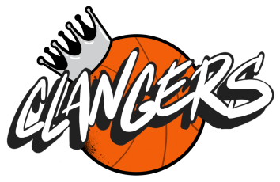

<h1 align="center">King's Heath Clangers Scheduling Application</h1>

<h3 align="center">Syntax Squad</h3>

<p align="center">School of Code Final Project</p>

<p align="center"></p>

<h2 align="center">About the Project</h2>
<p align="left">This project is a mobile and desktop friendly web application that supports the Kings Health Clangers Basketball Club organise and schedule themsevles all in one place. The application enables the club to have easy acces to event information and the main features are: users have the ability to create and amend events, control spaces and availability of training sessions and games and for users to book their place.</p>

<h2 align="center">How it works</h2>
<h3>User Journey:</h3>
Community club admins and coaches enjoy a seamless experience with our responsive website, accessible on any device. They can effortlessly add, amend, or delete training sessions, games, and events. The platform allows setting attendance limits for each event, ensuring proper planning and management. Players benefit from this functionality by easily accessing event details and booking their spots using their name and email. Additionally, users can submit enquiries through the contact form, explore the merchandise section to purchase club clothing, and visit the about page to learn more about the club's history and mission.<br>

<h3>Development Journey:</h3>
For developers, running the project locally begins with configuring the environment by adding the necessary keys into the .env.local file. Committing changes triggers pre-commit hooks and static testing tools like ESLint, Prettier, and Husky to maintain code quality and consistency. Adhering to the GitHub flow, developers create a pull request to manage changes to the main branch, minimizing the risk of errors. During this process, several checks are performed:

- GitGuardian Security Checks ensure no secrets or sensitive information are included in the code.
- Vercel Deployment confirms the changes have been successfully deployed.
- Vercel Preview Comments provide feedback on the preview deployment, highlighting any unresolved issues.

A different contributor reviews the pull request to ensure it meets the project's standards and guidelines. Once approved, the changes are merged and deployed, ensuring the website remains functional and up-to-date.<br>
Due to the time constraints of the project, a total duration of four weeks, unit testing was not implemented. However, end-to-end testing was completed using Playwright. Playwright was chosen for its ability to provide comprehensive testing by simulating real user interactions across different browsers, ensuring that all features function correctly from the user's perspective. This approach was deemed more effective for ensuring overall functionality within the limited time frame.
<h2 align="center">Links</h2>

- The Deployed Website: https://kingsheathclangers.me/
- GitHub Repository: https://github.com/lazycloud0/khc.git
- Project Presentation Video: https://www.youtube.com/watch?v=_2DT-UdjQ9U
- Presentation Slides: https://www.canva.com/design/DAGGbgboN5o/6AEuAy3tvzfhkTfeApH2Jg/edit?utm_content=DAGGbgboN5o&utm_campaign=designshare&utm_medium=link2&utm_source=sharebutton


<h2 align="center">Tech Stack</h2>

<p align="center">
    
    
    
    
    
    
    
    
    
    
    
    
    
    
    
    
</p>


<h2 align="center">Who We Are</h2>
<p align="left">Syntax Squad is a School of Code team who came together in the final four weeks of their bootcamp to plan, build and deploy a solution to a real-world problem posed by their stakeholder, King's Heath Community Basketball Club. <br>
 <br> After learning that the current method of scheduling games/training was a low-tech groupchat polling system, Syntax Squad explored potential solutions by conducting research, and the idea for King's Heath Clangers' scheduling application was founded. It would be able to improve the booking process for players whilst simultaneously giving easy access to coaches/admin staff to schedule new games.

This fantastic team was made up by the following developers:

[@Albert-S2](https://github.com/Albert-S2)  
[@Ayodimeji-stacks](https://github.com/Ayodimeji-stacks)  
[@KelseyBaker262](https://github.com/KelseyBaker262)  
[@josetutis](https://github.com/josetutis)
[@lazycloud0](https://github.com/lazycloud0)  
[@julesgsmith](https://github.com/julesgsmith)  

<h2 align="center">Project Overview</h2>


<h2 align="center">Running this Project</h2>
To run this project locally, you will need to do the following: <br><br>

Clone the project

```yaml
  git clone https://github.com/lazycloud0/khc.git
```

Go to the project directory

```yaml
  cd khc
```

Install dependencies

```yaml
  npm install
```
 or
```yaml 
  pnpm install
```

Start the server

```yaml
  npm run dev
```
or
```yaml
  pnpm dev
```

Your app template should now be running on [localhost:3000](http://localhost:3000/).

Add the following environment variables to your .env.local file:

``` yaml
NEXT_PUBLIC_SUPABASE_URL=" "
NEXT_PUBLIC_SUPABASE_ANON_KEY=" "

NEXT_PUBLIC_REACT_APP_SERVICE_ID=" "
NEXT_PUBLIC_REACT_APP_TEMPLATE_ID=" "
NEXT_PUBLIC_REACT_APP_PUBLIC_KEY=" "
```

<h3 align="center">Please Note:</h3>
All players should not be given access to this repository.<br><br>
Only those who have authorisation to use this repository will have the keys to the env.local file.
